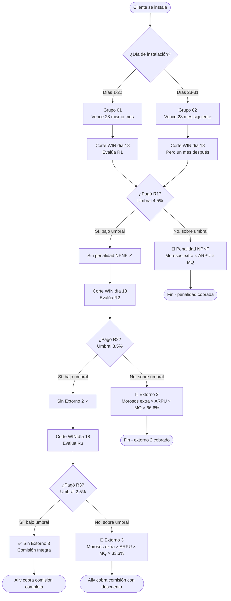
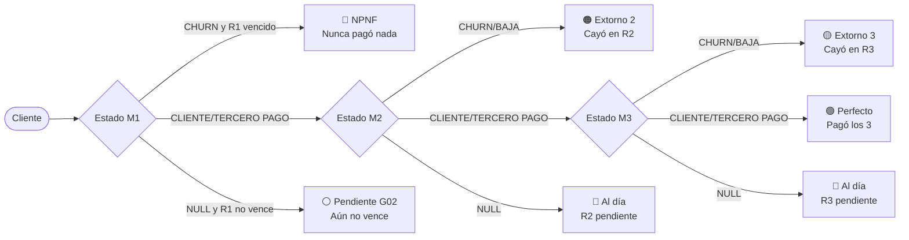
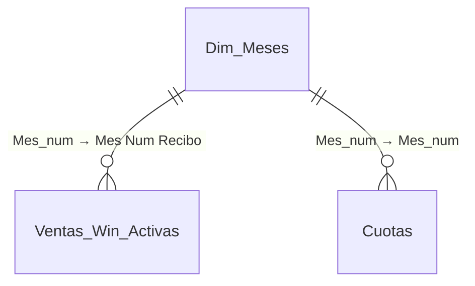
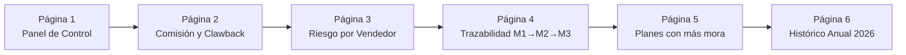

# 📡 WIN × Aliv Telecom — Documentación del Negocio y Sistema de Comisiones

> Documento de referencia para el equipo de análisis de Aliv Telecom.  
> Cubre la lógica de comisiones, clawback, grupos de facturación y clasificación de clientes.

---

## 1. ¿Quiénes son los actores?

| Actor | Rol | Analogía |
|---|---|---|
| **WIN** | Dueño del internet de fibra óptica. Pone las reglas, metas y paga las comisiones. | La discográfica que tiene la música |
| **Aliv Telecom** | Distribuidor autorizado. Vende el internet de WIN y cobra comisión por cada cliente instalado. | La tienda franquicia |
| **Vendedor / FFVV** | Equipo de campo que consigue clientes puerta a puerta. | El vendedor de la tienda |
| **Cliente final** | Hogar que contrata internet WIN a través de Aliv y paga una factura mensual. | El comprador |

---

## 2. Glosario de términos clave

### Términos comerciales

| Término | Significado simple | Ejemplo real |
|---|---|---|
| **Alta** | Una instalación nueva. Cada cliente instalado = 1 alta. | Enero 2026: 2,614 altas |
| **ARPU** | Precio del plan **sin IGV**. Base del cálculo de comisión. | Plan S/.100 con IGV → ARPU = S/.84.75 |
| **Meta / Cuota** | Número de altas que WIN le asigna a Aliv cada mes. | Enero: meta = 2,010 altas |
| **% Cumplimiento** | Altas reales ÷ Meta × 100. | 2,614 ÷ 2,010 = 130% |
| **Factor MQ** | Multiplicador de la comisión según % de cumplimiento. Va de 1.3 a 3.5. | 130% → Factor 3.5 |

### Tabla de factores (Top Gold)

| % Cumplimiento | Factor MQ |
|---|---|
| 0% – 56.99% | 1.3 |
| 57% – 64.99% | 1.5 |
| 65% – 72.99% | 2.0 |
| 73% – 80.99% | 2.5 |
| 81% – 88.99% | 2.8 |
| 89% – 96.99% | 3.0 |
| 97% – 104.99% | 3.2 |
| 105% a más | 3.5 |

### Términos de pago

| Término | Significado simple |
|---|---|
| **Recibo** | Factura mensual que paga el cliente. R1 = primer recibo, R2 = segundo, R3 = tercero. |
| **Cliente Pago** | El titular pagó su propio recibo. Escenario ideal. |
| **Tercero Pago** | Otra persona pagó el recibo por el titular. Cuenta como pagado pero es señal de riesgo. |
| **Churn** | Cliente que dejó de pagar o se dio de baja. |
| **NPNF** | "No Pagó Ni el Primer Recibo". El peor caso. |

### Términos de penalidad

| Término | Significado simple | Fórmula |
|---|---|---|
| **Umbral WIN** | % de morosos que WIN tolera sin penalizar. | R1: 4.5% / R2: 3.5% / R3: 2.5% |
| **Clawback** | Devolver parte de la comisión ya cobrada porque el MQ bajó al recalcular. | (MQ inicial − MQ recalculado) × Altas × ARPU |
| **Extorno 2** | Descuento directo por morosos en R2 que superan el umbral. | Morosos extras × ARPU × MQ × 66.6% |
| **Extorno 3** | Descuento directo por morosos en R3 que superan el umbral. | Morosos extras × ARPU × MQ × 33.3% |
| **Penalidad NPNF** | Cobro directo por clientes que nunca pagaron R1 y superan el umbral 4.5%. | Morosos extras × ARPU × MQ |

---

## 3. Los grupos de facturación

Dependiendo del día en que se instaló el cliente, su primer recibo vence en fechas distintas. Esto es crítico para no contar como morosos a clientes cuyo recibo aún no ha vencido.

| Grupo | Día de instalación | Vencimiento R1 | WIN evalúa en corte |
|---|---|---|---|
| **Grupo 01** | Días 1 al 22 | 28 del mismo mes | 18 del mes siguiente |
| **Grupo 02** | Días 23 al 31 | 28 del mes siguiente | 18 dos meses después |

> 💡 **Analogía**: como las tarjetas de crédito — si te afilias a principios de mes tu fecha de corte es diferente a si te afilias a fin de mes.

### Ejemplo concreto

- Cliente instalado el **10 de enero** → Grupo 01 → R1 vence el **28 de enero** → WIN evalúa el **18 de febrero**
- Cliente instalado el **25 de enero** → Grupo 02 → R1 vence el **28 de febrero** → WIN evalúa el **18 de marzo**

---

## 4. Cómo se calcula la comisión

### Fórmula base

```
Comisión Bruta = Altas × ARPU × Factor MQ
```

### Fórmula neta (después de descuentos)

```
Comisión Neta = Comisión Bruta − Penalidad NPNF − Extorno 2 − Extorno 3
```

### Ejemplo real — Enero 2026

| Concepto | Valor |
|---|---|
| Altas instaladas | 2,614 |
| ARPU promedio | S/.84.75 |
| % Cumplimiento | 130% |
| Factor MQ | 3.5 |
| **Comisión Bruta** | **S/.863,786** |
| Penalidad NPNF | S/.0 (2.56% < umbral 4.5%) |
| Extorno 2 | S/.0 (3.3% < umbral 3.5%) |
| Extorno 3 | −S/.5,461 (4.5% > umbral 2.5%) |
| **Comisión Neta** | **S/.858,325** |

---

## 5. El flujo completo del proceso



---

## 6. Los 7 casos posibles de un cliente

Cada cliente en la base de datos puede clasificarse en uno de estos 7 casos según su comportamiento de pago:



### Tabla de impacto por caso

| Caso | Descripción | Impacto en Aliv | Ejemplo real |
|---|---|---|---|
| 🟢 **Perfecto** | Pagó R1, R2 y R3 | Sin descuento | 5,223 clientes en 2026 |
| 🟡 **Extorno 3** | Pagó R1 y R2, no R3 | −S/.99 por cliente extra sobre umbral | 2,811 clientes |
| 🟠 **Extorno 2** | Pagó R1, no R2 | −S/.197 por cliente extra sobre umbral | 3,265 clientes — destruyó abril |
| 🔴 **NPNF** | Nunca pagó nada | −S/.296 por cliente extra sobre umbral | 431 clientes |
| 🔵 **Al día** | Pagó lo que venció, resto pendiente | Sin impacto aún | 230 clientes |
| ⚪ **Pendiente G02** | R1 todavía no vence | Sin impacto todavía | Mayo 2026 completo |

---

## 7. Resultados reales 2026 por mes

| Mes | Altas | Cuota | % Cumpl | Factor | Bruta | Descuentos | Neta | % Impacto |
|---|---|---|---|---|---|---|---|---|
| Enero | 2,614 | 2,010 | 130% | 3.5 | S/.863K | S/.5K | S/.858K | 0.6% 🟢 |
| Febrero | 3,089 | 2,210 | 140% | 3.5 | S/.1,012K | S/.13K | S/.999K | 1.2% 🟢 |
| Marzo | 2,842 | 1,920 | 148% | 3.5 | S/.903K | S/.270K | S/.633K | 30% 🟡 |
| Abril | 3,277 | 2,919 | 112% | 3.5 | S/.901K | S/.515K | S/.386K | 57% 🔴 |
| Mayo | 2,404 | 3,386 | 71% | 2.0 | S/.363K | S/.0* | S/.363K | 0%* |

> *Mayo: todos los clientes son Grupo 02 — su R1 vence el 28 de mayo/junio. No hay morosos evaluables todavía.

### Hallazgo clave

> ⚠️ **El problema de Aliv no es la captación — es el seguimiento post-instalación.**
> 
> El NPNF en todos los meses está **bajo el umbral del 4.5%**. Los clientes sí pagan el primer recibo. El problema es que desaparecen en el segundo y tercero, generando Extornos 2 y 3 que se comieron **S/.514K solo en abril**.

---

## 8. Modelo de Power BI construido

### Tablas del modelo

| Tabla | Tipo | Descripción |
|---|---|---|
| `Ventas_Win_Activas` | Datos (SQL Server) | Tabla principal con 14,814 clientes activos 2026 |
| `Cuotas` | Calculada | Metas mensuales de Lima y todas las ciudades de provincias |
| `Factor_MQ` | Calculada | Tabla de factores multiplicadores según % cumplimiento |
| `Dim_Meses` | Calculada | Dimensión de tiempo para relacionar ventas y cuotas |
| `Recibos_Eje` | Calculada | Eje para gráficos de trazabilidad M1/M2/M3 |

### Relaciones



### Columnas calculadas en Ventas_Win_Activas

| Columna | Carpeta | Descripción |
|---|---|---|
| `Grupo_Facturacion` | 17. Grupos | Grupo 01 o Grupo 02 según día de instalación |
| `Vencimiento_R1` | 17. Grupos | Fecha real de vencimiento del primer recibo |
| `R1_Ya_Vencio` | 17. Grupos | TRUE si el R1 ya venció hoy |
| `Dias_Desde_Vencimiento_R1` | 17. Grupos | Días desde el vencimiento (negativo = aún no vence) |
| `Tipo_Caso_Clawback` | 17. Grupos | Clasificación completa: NPNF, Extorno 2, Extorno 3, Perfecto, etc. |
| `Caso_Etiqueta` | 17. Grupos | Versión corta para gráficos: "Nunca pago", "Cayó en R2", etc. |
| `Riesgo_Clawback` | 17. Grupos | Categoría de riesgo: Penalidad NPNF / Extorno 2 / Extorno 3 / Sin riesgo / Pendiente |

### Medidas clave por carpeta

#### 13. Comisión y ARPU
| Medida | Descripción |
|---|---|
| `ARPU Promedio` | Precio promedio sin IGV con reglas especiales WIN |
| `ARPU Total` | Suma de ARPU de todos los clientes del contexto |

#### 14. Metas y Cumplimiento
| Medida | Descripción |
|---|---|
| `Total Altas` | Conteo de instalaciones del mes |
| `Cuota Total Mes` | Meta asignada por WIN para el mes filtrado |
| `% Cumplimiento Meta` | Altas ÷ Cuota |
| `Factor MQ` | Factor multiplicador según % cumplimiento |
| `Altas Faltantes Meta` | Cuántas altas faltan para llegar a la meta |
| `Dias Restantes Corte` | Días hasta el corte del 18 |
| `Altas Acumuladas Mes` | Altas acumuladas día a día dentro del mes |

#### 15. Comisión Proyectada
| Medida | Descripción |
|---|---|
| `Comision Base Bruta` | Altas × ARPU × Factor MQ |
| `NPNF Sobre Umbral` | Clientes NPNF que exceden el 4.5% (corregido con R1 vencido) |
| `Penalidad NPNF` | NPNF sobre umbral × ARPU × Factor |
| `Morosos M2 Sobre Umbral` | Clientes sin R2 que exceden el 3.5% |
| `Extorno 2` | Morosos M2 extras × ARPU × Factor × 66.6% |
| `Morosos M3 Sobre Umbral` | Clientes sin R3 que exceden el 2.5% |
| `Extorno 3` | Morosos M3 extras × ARPU × Factor × 33.3% |
| `Total Descuentos` | NPNF + Extorno 2 + Extorno 3 |
| `Comision Neta Estimada` | Bruta − Total Descuentos |
| `% Impacto Clawback` | Total Descuentos ÷ Comisión Bruta |
| `Comision Neta Acumulada` | Neta acumulada desde enero hasta el mes en contexto |
| `Variacion Neta vs Mes Anterior` | Diferencia en soles vs mes anterior |

#### 16. Semáforo Página 1
| Medida | Descripción |
|---|---|
| `% NPNF vs Umbral 4.5` | % real de NPNF sobre clientes evaluables |
| `% Morosos R2 vs Umbral 3.5` | % morosos R2 sobre pagadores R1 |
| `% Morosos R3 vs Umbral 2.5` | % morosos R3 sobre pagadores R2 |
| `Semaforo NPNF` | 🟢 Bajo control / 🟡 En límite / 🔴 Sobre umbral |
| `Semaforo R2` | Igual para R2 |
| `Semaforo R3` | Igual para R3 |
| `Color NPNF / R2 / R3` | Hex para formato condicional en Power BI |
| `Color Cumplimiento` | Verde/Amarillo/Rojo según % cumplimiento |

#### 17. Grupos Facturación
| Medida | Descripción |
|---|---|
| `Altas Evaluables R1` | Solo clientes con R1 ya vencido |
| `NPNF Evaluables` | Churn sobre clientes con R1 vencido |
| `Clientes Pendientes Vencer R1` | Grupo 02 que aún no vencen |

---

## 9. Dashboard planeado — 6 páginas



| Página | Pregunta que responde | Visuals principales |
|---|---|---|
| **1. Panel** | ¿Cómo estamos hoy? | 4 KPI Cards, 3 semáforos WIN, Línea altas vs meta, Donut M1 |
| **2. Comisión** | ¿Cuánto vamos a cobrar y cuánto perdemos? | Waterfall, Barras brutas vs netas, Línea % impacto, Tabla por ciudad |
| **3. Riesgo** | ¿Quién genera el problema? | Ranking vendedores, Perfiles por vendedor, Tabla NPNF, Mapa calor |
| **4. Trazabilidad** | ¿Dónde se pierde la gente? | Funnel M1→M2→M3, Flujos de estado, Tasas de pago |
| **5. Planes** | ¿Qué planes tienen más mora? | Bar % churn por plan, Scatter ARPU vs churn, Tabla por plan |
| **6. Histórico** | ¿El año va bien o mal? | Barras altas vs meta, Línea neta acumulada, Tabla resumen anual |

---

## 10. SQL para la vista — Clasificación de clientes

Agrega estas 3 columnas calculadas a tu vista en SQL Server. Las fechas en `ventas_aliv` son `varchar` en formato `dd-mm-yyyy`, por eso se usa `TRY_CONVERT` con estilo 105.

```sql
-- COLUMNA 1: Tipo_Caso_Clawback
CASE
    WHEN [Estado M1] IS NULL 
         AND TRY_CONVERT(DATE, [Fecha vencimiento M1], 105) >= CAST(GETDATE() AS DATE)
        THEN 'Pendiente - R1 no vence'
    WHEN [Estado M1] IS NULL 
         AND TRY_CONVERT(DATE, [Fecha vencimiento M1], 105) < CAST(GETDATE() AS DATE)
        THEN 'Sin clasificar'
    WHEN [Estado M1] IN ('CHURN', 'CLIENTE DE BAJA')
         AND TRY_CONVERT(DATE, [Fecha vencimiento M1], 105) < CAST(GETDATE() AS DATE)
        THEN 'NPNF'
    WHEN [Estado M1] = 'CHURN'
         AND [Estado M2] = 'PENDIENTE RECIBO ANTERIOR'
        THEN 'NPNF'
    WHEN [Estado M1] IN ('CLIENTE PAGO', 'TERCERO PAGO')
         AND [Estado M2] IN ('CHURN', 'CLIENTE DE BAJA')
        THEN 'Extorno 2 - cayo en R2'
    WHEN [Estado M1] IN ('CLIENTE PAGO', 'TERCERO PAGO')
         AND [Estado M2] IN ('CLIENTE PAGO', 'TERCERO PAGO')
         AND [Estado M3] IN ('CHURN', 'CLIENTE DE BAJA')
        THEN 'Extorno 3 - cayo en R3'
    WHEN [Estado M1] IN ('CLIENTE PAGO', 'TERCERO PAGO')
         AND [Estado M2] IN ('CLIENTE PAGO', 'TERCERO PAGO')
         AND [Estado M3] IN ('CLIENTE PAGO', 'TERCERO PAGO')
        THEN 'Perfecto - pago 3 recibos'
    WHEN [Estado M1] IN ('CLIENTE PAGO', 'TERCERO PAGO')
         AND [Estado M2] IN ('CLIENTE PAGO', 'TERCERO PAGO')
         AND [Estado M3] IS NULL
        THEN 'Al dia - R3 pendiente'
    WHEN [Estado M1] IN ('CLIENTE PAGO', 'TERCERO PAGO')
         AND [Estado M2] IS NULL
        THEN 'Al dia - R2 pendiente'
    ELSE 'Sin clasificar'
END AS Tipo_Caso_Clawback,

-- COLUMNA 2: Caso_Etiqueta (version corta para graficos)
CASE
    WHEN [Estado M1] IN ('CHURN','CLIENTE DE BAJA')
         AND TRY_CONVERT(DATE, [Fecha vencimiento M1], 105) < CAST(GETDATE() AS DATE)  THEN 'Nunca pago'
    WHEN [Estado M1] = 'CHURN'
         AND [Estado M2] = 'PENDIENTE RECIBO ANTERIOR'                                  THEN 'Nunca pago'
    WHEN [Estado M1] IN ('CLIENTE PAGO','TERCERO PAGO')
         AND [Estado M2] IN ('CHURN','CLIENTE DE BAJA')                                 THEN 'Cayo en R2'
    WHEN [Estado M1] IN ('CLIENTE PAGO','TERCERO PAGO')
         AND [Estado M2] IN ('CLIENTE PAGO','TERCERO PAGO')
         AND [Estado M3] IN ('CHURN','CLIENTE DE BAJA')                                 THEN 'Cayo en R3'
    WHEN [Estado M1] IN ('CLIENTE PAGO','TERCERO PAGO')
         AND [Estado M2] IN ('CLIENTE PAGO','TERCERO PAGO')
         AND [Estado M3] IN ('CLIENTE PAGO','TERCERO PAGO')                             THEN 'Pago los 3'
    WHEN [Estado M1] IN ('CLIENTE PAGO','TERCERO PAGO')
         AND [Estado M2] IN ('CLIENTE PAGO','TERCERO PAGO')
         AND [Estado M3] IS NULL                                                         THEN 'Al dia R3 pend'
    WHEN [Estado M1] IN ('CLIENTE PAGO','TERCERO PAGO')
         AND [Estado M2] IS NULL                                                         THEN 'Al dia R2 pend'
    WHEN [Estado M1] IS NULL
         AND TRY_CONVERT(DATE, [Fecha vencimiento M1], 105) >= CAST(GETDATE() AS DATE)  THEN 'Pendiente G02'
    ELSE 'Sin clasificar'
END AS Caso_Etiqueta,

-- COLUMNA 3: Riesgo_Clawback (semaforo simple)
CASE
    WHEN [Estado M1] IN ('CHURN','CLIENTE DE BAJA')
         AND TRY_CONVERT(DATE, [Fecha vencimiento M1], 105) < CAST(GETDATE() AS DATE)   THEN 'Penalidad NPNF'
    WHEN [Estado M1] = 'CHURN'
         AND [Estado M2] = 'PENDIENTE RECIBO ANTERIOR'                                   THEN 'Penalidad NPNF'
    WHEN [Estado M1] IN ('CLIENTE PAGO','TERCERO PAGO')
         AND [Estado M2] IN ('CHURN','CLIENTE DE BAJA')                                  THEN 'Extorno 2'
    WHEN [Estado M1] IN ('CLIENTE PAGO','TERCERO PAGO')
         AND [Estado M2] IN ('CLIENTE PAGO','TERCERO PAGO')
         AND [Estado M3] IN ('CHURN','CLIENTE DE BAJA')                                  THEN 'Extorno 3'
    WHEN [Estado M1] IN ('CLIENTE PAGO','TERCERO PAGO')
         AND [Estado M2] IN ('CLIENTE PAGO','TERCERO PAGO')
         AND [Estado M3] IN ('CLIENTE PAGO','TERCERO PAGO')                              THEN 'Sin riesgo'
    WHEN [Estado M1] IN ('CLIENTE PAGO','TERCERO PAGO')
         AND ([Estado M2] IS NULL OR [Estado M3] IS NULL)                                THEN 'Pendiente evaluacion'
    WHEN [Estado M1] IS NULL
         AND TRY_CONVERT(DATE, [Fecha vencimiento M1], 105) >= CAST(GETDATE() AS DATE)  THEN 'Pendiente evaluacion'
    ELSE 'Sin clasificar'
END AS Riesgo_Clawback
```

---

## 11. Notas técnicas importantes

### Sobre las fechas en SQL Server
La columna `Fecha vencimiento M1` (y M2, M3) está guardada como `varchar` con formato `dd-mm-yyyy`. Siempre usar `TRY_CONVERT(DATE, columna, 105)` para convertirla. Nunca usar `CAST` directo ni `CONVERT` sin estilo — fallará.

### Sobre la columna Fecha de Pago
La columna `[Fecha de Pago]` guarda `00-00-0000` cuando el cliente no pagó (en vez de NULL). No usarla para calcular pagados — usar siempre `[Estado M1]`, `[Estado M2]`, `[Estado M3]`.

### Sobre el NPNF de Mayo
Mayo 2026 mostraba 95.6% de NPNF antes de la corrección. Esto era falso — todos los clientes de mayo son Grupo 02 y su R1 no había vencido. Después de la corrección con `Fecha vencimiento M1 < TODAY()`, mayo muestra ⚪ Sin data correctamente.

### Sobre la actualización de datos
El archivo `Aliv_ventas_activas.xls` se descarga diariamente desde el sistema WIN y se sube a SQL Server (`dbo.ventas_aliv`). Power BI se conecta a esta tabla y se actualiza con los datos del día.

---

*Documentación generada el 28 de mayo de 2026*  
*Elaborado por el equipo de análisis de Aliv Telecom*